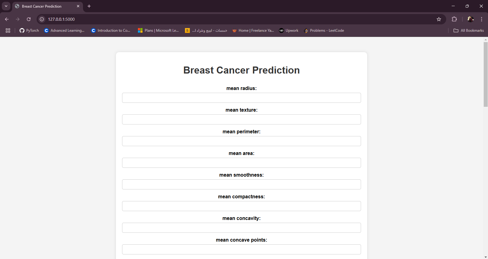

# Breast Cancer Prediction Web App

## 📌 Project Overview

This project is a **Flask-based web application** for predicting breast cancer (Benign or Malignant) using a pre-trained **PyTorch neural network model**. Users can input **30 medical features**, and the model will classify the tumor as either **Malignant** (cancerous) or **Benign** (non-cancerous).

## 🚀 Features

- **Web-based UI**: Enter medical feature values and get predictions instantly.
- **Flask Backend**: Handles user input and model inference.
- **PyTorch Model Integration**: Loads and runs a trained neural network.
- **Standardization**: Uses `StandardScaler` from `sklearn` for feature normalization.
- **Real-time Predictions**: Outputs either "Malignant" or "Benign" based on the model’s decision.

## 🛠️ Technologies Used

- **Python 3.12**
- **Flask** (Web framework)
- **PyTorch** (Deep learning framework)
- **NumPy** (Array manipulation)
- **Scikit-learn** (Feature scaling)
- **HTML & CSS** (Frontend UI)

## 📂 Project Structure

```
📂 breast_cancer_app
├── 📄 app.py                 # Flask backend
├── 📄 model.pkl              # Trained PyTorch model
├── 📂 templates              # HTML files
│   ├── index.html            # Input form page
│   ├── result.html           # Prediction result page
├── 📄 README.md              # Documentation
```

## 🎯 How to Run the Project

### 🔹 Step 1: Clone the Repository

```bash
git clone https://github.com/your-username/breast-cancer-app.git
cd breast-cancer-app
```

### 🔹 Step 2: Install Dependencies

Ensure you have Python 3.12 installed. Then, install the required packages:

```bash
pip install flask torch numpy scikit-learn
```

### 🔹 Step 3: Run the Flask App

```bash
python app.py
```

The app will run at **[http://127.0.0.1:5000/](http://127.0.0.1:5000/)**. Open it in your browser.

## 🎯 Usage

1. Enter values for **30 medical features**.
2. Click the **Predict** button.
3. View the result (**Benign** or **Malignant**).

## 📌 API Endpoint

| Method | Endpoint   | Description                                |
| ------ | ---------- | ------------------------------------------ |
| POST   | `/predict` | Accepts form data and returns a prediction |

## 🔥 Screenshots

### 

## 🔧 Possible Enhancements

- **Deploy on Heroku or AWS**
- **Improve UI with Bootstrap or React**
- **Enhance model performance with feature engineering**

## 🤝 Contributing

Feel free to fork this repository and submit pull requests. Suggestions are welcome!

## 📜 License

This project is licensed under the **MIT License**.

